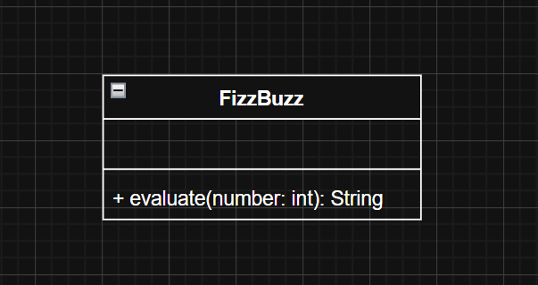
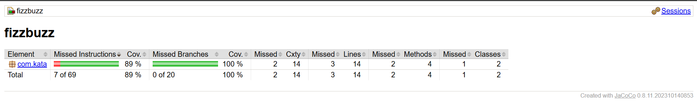
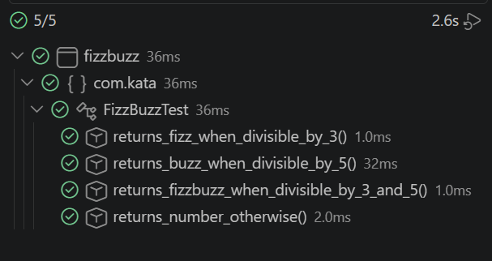
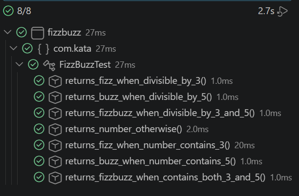

# Kata FizzBuzz - Java

## 📝 Descripción

Implementación de la kata FizzBuzz en Java usando TDD (Test Driven Development).

El programa evalúa números del 1 al 100 aplicando las siguientes reglas:

**Etapa 1:**
- Devuelve `Fizz` si el número es divisible por 3
- Devuelve `Buzz` si el número es divisible por 5
- Devuelve `FizzBuzz` si el número es divisible por 3 y por 5
- Devuelve el mismo número si no se cumple ninguna regla

**Etapa 2:**
- Devuelve `Fizz` si el número es divisible por 3 o contiene el dígito 3
- Devuelve `Buzz` si el número es divisible por 5 o contiene el dígito 5

## 💻 Tecnologías

- Java 21
- JUnit 5
- Hamcrest
- Maven
- JaCoCo

## 🎨 Estructura 

## Estructura del proyecto

Kata-FizzBuzz-Java/
├── assets/
│   ├── cobertura-tests.png
│   ├── diagrama-clase.png
│   ├── tests1.png
│   └── tests2.png
├── fizzbuzz/
│   ├── src/
│   │   ├── main/java/com/kata/
│   │   │   ├── App.java
│   │   │   └── FizzBuzz.java
│   │   └── test/java/com/kata/
│   │       └── FizzBuzzTest.java
│   └── pom.xml
└── README.md

# 📷 Capturas

## Diagrama de clases

## Cobertura de tests

## Tests Etapa 1

## Tests Etapa 2

# ✍️ Autora

duran-ni